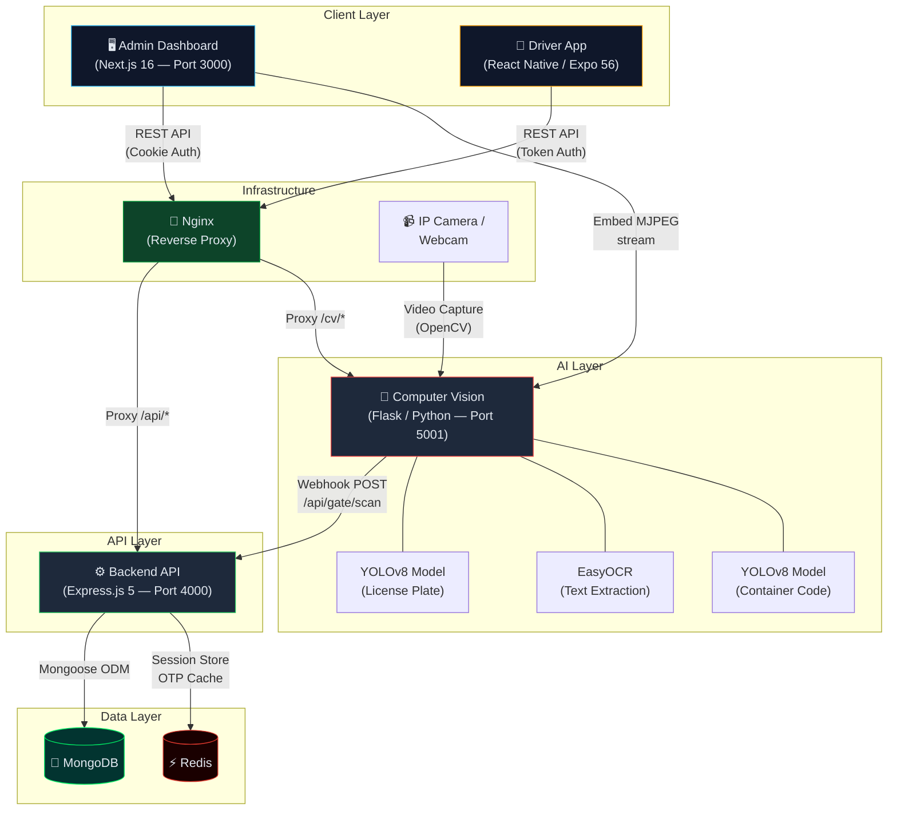
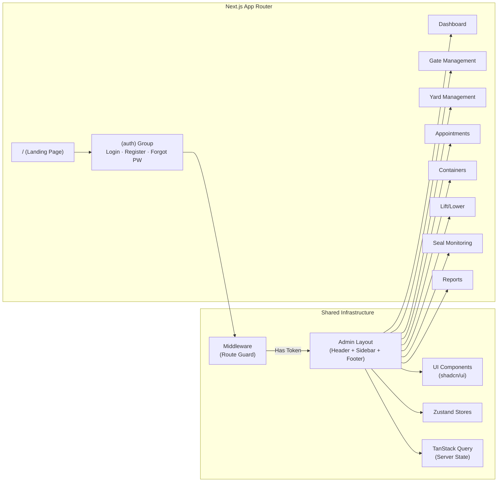
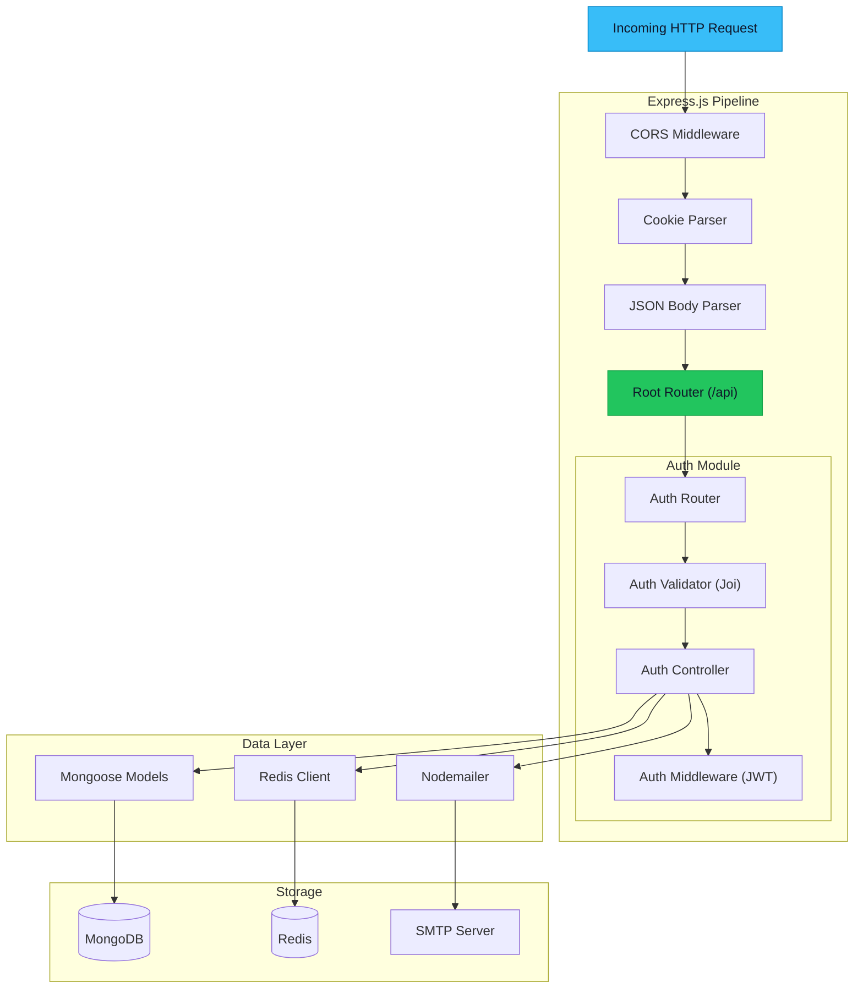
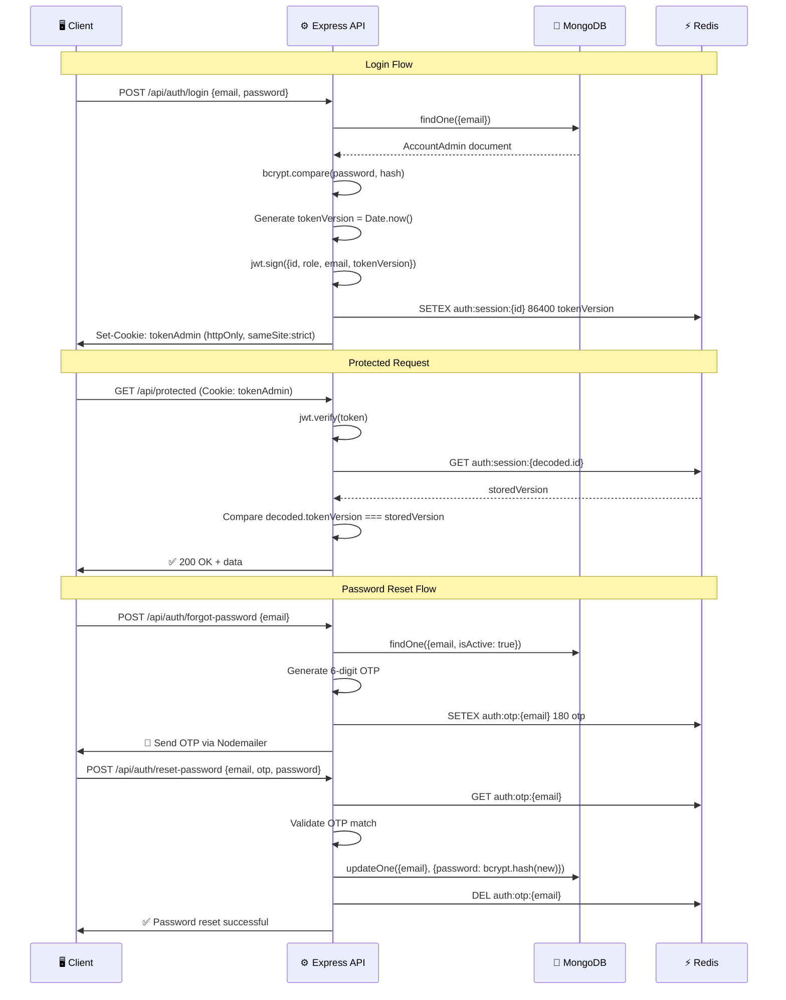
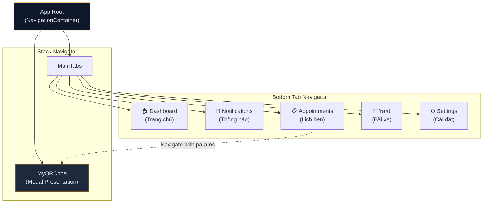
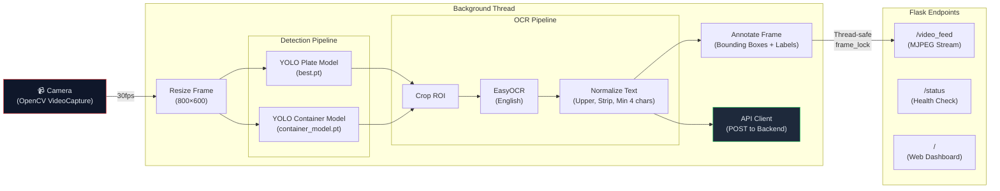
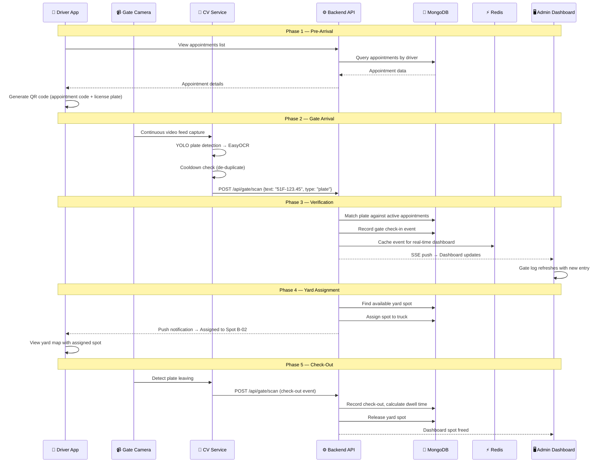

# LogiPort — Technical Deep Dive

> **Document Purpose:** This document provides an in-depth technical analysis of the LogiPort platform architecture, component design, data flows, API surface, and implementation decisions. It is intended for developers, system architects, and technical evaluators.

---

## Table of Contents

- [1. System Architecture](#1-system-architecture)
- [2. Component Breakdown](#2-component-breakdown)
  - [2.1 Frontend (Admin Dashboard)](#21-frontend-admin-dashboard)
  - [2.2 Backend (REST API)](#22-backend-rest-api)
  - [2.3 Mobile App (Driver Portal)](#23-mobile-app-driver-portal)
  - [2.4 AI / Computer Vision Service](#24-ai--computer-vision-service)
- [3. API Documentation Overview](#3-api-documentation-overview)
- [4. Data Flow](#4-data-flow)
- [5. Authentication & Security Architecture](#5-authentication--security-architecture)
- [6. Database Design](#6-database-design)
- [7. Challenges & Solutions](#7-challenges--solutions)

---

## 1. System Architecture

LogiPort follows a **microservices-oriented architecture** with four independent services communicating over HTTP/REST. Each service is containerized and can be deployed independently.



### Architecture Principles

| Principle | Implementation |
|:----------|:---------------|
| **Separation of Concerns** | Each platform (web, mobile, AI) is an independent codebase with its own dependency tree |
| **Stateless API** | Backend is stateless; session validation delegated to Redis |
| **Event-Driven AI** | CV service pushes scan events via webhooks rather than polling |
| **Cookie-Based Web Auth** | HTTP-only cookies prevent XSS token theft on web dashboard |
| **Single-Session Enforcement** | Redis token versioning ensures only one active session per user |

---

## 2. Component Breakdown

### 2.1 Frontend (Admin Dashboard)

**Stack:** Next.js 16 · React 19 · TypeScript · Tailwind CSS 4 · shadcn/ui · Zustand · TanStack Query

#### Application Architecture



#### Page Route Map

| Route | Component | Description |
|:------|:----------|:------------|
| `/` | `page.tsx` | Public landing page with navigation links |
| `/admin/login` | `(auth)/login/page.tsx` | Authentication page (email + password) |
| `/admin/dashboard` | `dashboard/page.tsx` | Real-time operational overview with stat cards |
| `/admin/appointments` | `appointments/page.tsx` | TAS booking management with time-slot forms |
| `/admin/gate` | `gate/page.tsx` | Gate check-in/check-out with AI camera feed |
| `/admin/yard` | `yard/page.tsx` | Block-Bay-Row-Tier grid visualization |
| `/admin/containers` | `containers/page.tsx` | Container inventory (20ft/40ft tracking) |
| `/admin/lift` | `lift/page.tsx` | Lift/lower equipment operation records |
| `/admin/seal` | `seal/page.tsx` | IoT seal health (temp, humidity, tamper alerts) |
| `/admin/reports` | `reports/page.tsx` | Analytics dashboards with chart visualizations |

#### State Management Strategy

| Concern | Tool | Rationale |
|:--------|:-----|:----------|
| **Server State** (API data) | TanStack Query v5 | Automatic caching, background refetching, pagination |
| **Client State** (UI state) | Zustand v5 | Minimal boilerplate, devtools-friendly |
| **Form State** | React Hook Form + Zod | Declarative validation with schema-based types |
| **Theme** | Custom ThemeProvider | CSS variable-based light/dark mode toggle |

#### Middleware (Route Protection)

The frontend implements a **Next.js middleware** at `src/middleware.ts` that intercepts all `/admin/*` routes:

1. **Unauthenticated users** accessing protected routes → redirected to `/admin/login`
2. **Authenticated users** accessing auth pages → redirected to `/admin/dashboard`
3. Token is read from the `tokenAdmin` HTTP-only cookie

#### UI/UX Architecture

- **Design System:** shadcn/ui component library built on Radix UI primitives
- **Component Variants:** `class-variance-authority` for multi-variant button/card styles
- **Animations:** Framer Motion v12 for page transitions and micro-interactions
- **Icons:** Lucide React icon set (consistent, tree-shakeable)
- **Responsive:** Mobile-first Tailwind breakpoints with collapsible sidebar

#### Key Frontend Libraries

| Library | Purpose |
|:--------|:--------|
| `@hookform/resolvers` + `zod` | Type-safe form validation |
| `@tanstack/react-query` | Data fetching, caching, and synchronization |
| `zustand` | Lightweight client state management |
| `framer-motion` | Smooth animations and page transitions |
| `lucide-react` | SVG icon components |
| `use-sse.ts` | Custom hook for Server-Sent Events (real-time updates) |
| `use-realtime-spots.ts` | Real-time yard spot subscription hook |
| `astar.ts` | A* pathfinding algorithm for yard navigation |

---

### 2.2 Backend (REST API)

**Stack:** Express.js 5 · TypeScript · MongoDB (Mongoose 9) · Redis · JWT · Joi · Nodemailer

#### Server Architecture



#### Module Architecture

The backend follows a **modular MVC pattern** with the following layered structure:

```
Request → Router → Validator → Controller → Model → Database
                                    ↓
                              Helper Services (Mail, Redis)
```

| Layer | Directory | Responsibility |
|:------|:----------|:---------------|
| **Routing** | `routers/` | URL → handler mapping, middleware chaining |
| **Validation** | `validators/` | Request schema enforcement with Joi |
| **Business Logic** | `controllers/` | Core domain operations |
| **Data Access** | `models/` | Mongoose schema definitions & queries |
| **Middleware** | `middlewares/` | Cross-cutting concerns (auth, logging) |
| **Config** | `config/` | Database & Redis connection factories |
| **Helpers** | `helpers/` | Transactional email, utilities |

#### Database Schema Overview

<details>
<summary><strong>AccountAdmin Schema (MongoDB)</strong></summary>

```typescript
{
  fullName:    String    // Required — User's full display name
  email:       String    // Required, Unique — Login identifier
  role:        String    // Required, Default: "operator" — Role-based access
  password:    String    // Required — bcrypt-hashed password
  isActive:    Boolean   // Required, Default: false — Account activation status
  createdAt:   Date      // Auto — Mongoose timestamps
  updatedAt:   Date      // Auto — Mongoose timestamps
}
```

</details>

#### Redis Key Schema

| Key Pattern | TTL | Purpose |
|:------------|:----|:--------|
| `auth:session:{userId}` | 86,400s (24h) | Active session token version for single-session enforcement |
| `auth:otp:{email}` | 180s (3min) | OTP code for password reset verification |
| `auth:token:{userId}` | 86,400s (24h) | Token version cross-check for device lock |

#### Authentication Flow



#### Performance Optimization Strategies

| Strategy | Implementation |
|:---------|:---------------|
| **Session Caching** | Redis stores active session versions (O(1) lookup vs. DB query) |
| **OTP Rate Limiting** | Redis TTL-based cooldown prevents OTP spam (1 OTP / 3 min / email) |
| **Single-Session Lock** | Token version mismatch auto-invalidates stale sessions |
| **Stateless JWT** | No server-side session table; verification via Redis version check |
| **Cookie Security** | `httpOnly` + `sameSite: strict` prevents XSS and CSRF attacks |

---

### 2.3 Mobile App (Driver Portal)

**Stack:** React Native 0.85 · Expo SDK 56 · TypeScript · React Navigation 7 · TanStack Query · Zustand

#### Navigation Architecture



#### Screen Inventory

| Screen | Directory | Key Features |
|:-------|:----------|:-------------|
| `DashboardScreen` | `screens/dashboard/` | Summary cards (check-ins, free spots, pending tasks, alerts), next appointment widget |
| `NotificationsScreen` | `screens/notifications/` | Categorized alerts (warning, success, info) with read/unread states |
| `AppointmentsScreen` | `screens/appointments/` | Appointment list with status badges (Confirmed, Pending, Waiting), QR generation |
| `YardScreen` | `screens/yard/` | Zone-based spot grid (A, B, C) with Free/Occupied/Reserved indicators |
| `SettingsScreen` | `screens/settings/` | User profile and app preferences |
| `MyQRCodeScreen` | `screens/qr/` | Full-screen QR code display with appointment details overlay |

#### Provider Architecture

The app wraps the component tree with a layered provider hierarchy:

```
GestureHandlerRootView
  └── SafeAreaProvider
       └── QueryClientProvider (TanStack Query)
            └── NavigationContainer (Dark Theme)
                 └── AppNavigator
```

#### Design System

- **Color Palette:** Custom dark theme (`stitchPalette`) — `#07111f` background, `#f59e0b` accent (amber), `#f8fafc` text
- **Component Library:** React Native Paper (Material Design 3 components)
- **Animations:** React Native Reanimated v4 for 60fps gesture-driven animations
- **Icons:** Ionicons via `@expo/vector-icons`
- **QR Generation:** `react-native-qrcode-svg` for contactless gate check-in codes

#### Data Layer

| Concern | Solution |
|:--------|:---------|
| API Client | Axios with base URL configuration |
| Server State | TanStack Query v5 with automatic background refetching |
| Client State | Zustand v5 for auth tokens & UI preferences |
| Type Definitions | Centralized TypeScript interfaces in `types/portal.ts` |

#### Type System

```typescript
interface DashboardSummary {
  checkInsToday: number;
  freeSpots: number;
  pendingTasks: number;
  activeAlerts: number;
  nextAppointment: string;
}

interface AppointmentItem {
  code: string;     // e.g., "AP-1024"
  time: string;     // e.g., "09:30"
  truck: string;    // e.g., "Truck 19"
  status: "Confirmed" | "Pending" | "Waiting";
}

interface YardSpot {
  id: string;       // e.g., "A-01"
  zone: string;     // e.g., "A"
  status: "Free" | "Occupied" | "Reserved";
}
```

---

### 2.4 AI / Computer Vision Service

**Stack:** Python 3 · Flask · YOLOv8 (Ultralytics) · EasyOCR · OpenCV · Requests

#### AI Pipeline Architecture



#### Dual-Model Detection System

The CV service runs **two YOLO models** concurrently on each frame:

| Model | File | Purpose | Bounding Box Color |
|:------|:-----|:--------|:-------------------|
| License Plate Detector | `best.pt` (6.2 MB) | Detects Vietnamese license plate regions | 🔴 Red (detection) + 🟢 Green (OCR text) |
| Container Code Detector | `container_model.pt` | Detects ISO container code regions | 🔵 Blue (detection) + 🟡 Yellow (OCR text) |

#### Processing Pipeline (Per Frame)

1. **Capture** — OpenCV grabs frame from camera device (configurable index or RTSP URL)
2. **Resize** — Frame downscaled to 800×600 for processing speed optimization
3. **YOLO Inference** — Both plate and container models run independently
4. **Confidence Filter** — Detections below `DETECTION_CONFIDENCE_THRESHOLD` (default: 0.5) are discarded
5. **ROI Cropping** — Bounding box regions are cropped from the frame
6. **EasyOCR** — Text extraction on cropped ROIs with `OCR_CONFIDENCE_THRESHOLD` (default: 0.4)
7. **Text Normalization** — Results are uppercased, stripped, and validated (min 4 characters)
8. **De-duplication** — Cooldown registry prevents resending the same text within `COOLDOWN_PERIOD` (5 seconds)
9. **Webhook Dispatch** — Valid new detections are POSTed to `http://localhost:4000/api/gate/scan`
10. **Annotation** — Bounding boxes and OCR text rendered onto the frame for the live video feed

#### Intelligent Cooldown System

The `api_client.py` implements a **memory-efficient cooldown registry** that prevents flooding the backend with duplicate scan events:

```python
# In-memory registry: { "TEXT_VALUE": last_sent_timestamp }
_cooldown_registry = {}

# Lifecycle:
# 1. New detection → check registry → not found → SEND → record timestamp
# 2. Same detection within 5s → SKIP (throttled)
# 3. Same detection after 5s → SEND → update timestamp
# 4. Periodic cleanup removes expired entries to prevent memory growth
```

#### Flask API Endpoints

| Endpoint | Method | Content-Type | Description |
|:---------|:-------|:-------------|:------------|
| `/` | GET | `text/html` | Built-in monitoring dashboard with live feed embed |
| `/video_feed` | GET | `multipart/x-mixed-replace` | MJPEG live video stream (embeddable in `` tags) |
| `/status` | GET | `application/json` | Health check: camera status, model loading, backend webhook URL |
| `/favicon.ico` | GET | — | Returns 204 No Content (prevents 404 log spam) |

#### Configuration (Environment Variables)

| Variable | Default | Description |
|:---------|:--------|:------------|
| `FLASK_HOST` | `0.0.0.0` | Server bind address |
| `FLASK_PORT` | `5001` | Server port |
| `CAMERA_INDEX` | `0` | Camera device index (int) or RTSP URL (string) |
| `BACKEND_URL` | `http://localhost:4000/api/gate/scan` | Backend webhook endpoint |
| `YOLO_PLATE_MODEL_PATH` | `models/best.pt` | Path to license plate YOLO weights |
| `YOLO_CONTAINER_MODEL_PATH` | `models/container_model.pt` | Path to container YOLO weights |
| `DETECTION_CONFIDENCE_THRESHOLD` | `0.5` | Minimum detection confidence |
| `OCR_CONFIDENCE_THRESHOLD` | `0.4` | Minimum OCR confidence |
| `COOLDOWN_PERIOD` | `5.0` | De-duplication cooldown (seconds) |

#### Thread Safety Model

The service uses a **producer-consumer threading pattern**:

- **Producer Thread** (background): Continuously captures frames, runs AI inference, stores latest JPEG bytes
- **Consumer** (Flask request handler): Reads latest JPEG bytes for MJPEG stream response
- **Synchronization:** `threading.Lock()` (`frame_lock`) guards shared frame buffer access
- **Frame Rate:** ~30fps output stream with 10ms yield between captures to prevent CPU saturation

---

## 3. API Documentation Overview

### Authentication Endpoints

| Method | Endpoint | Body | Description |
|:-------|:---------|:-----|:------------|
| `POST` | `/api/auth/register` | `{ fullName, email, role, password }` | Create new admin account |
| `POST` | `/api/auth/login` | `{ email, password }` | Authenticate and set session cookie |
| `GET` | `/api/auth/logout` | — | Clear session cookie and Redis session |
| `POST` | `/api/auth/forgot-password` | `{ email }` | Generate and email 6-digit OTP |
| `POST` | `/api/auth/reset-password` | `{ email, otp, password }` | Verify OTP and update password |

### AI / CV Endpoints

| Method | Endpoint | Response | Description |
|:-------|:---------|:---------|:------------|
| `GET` | `/video_feed` | MJPEG Stream | Live annotated camera feed |
| `GET` | `/status` | JSON | Service diagnostics and health |

### Webhook Payloads (CV → Backend)

```json
{
  "text": "51F-123.45",
  "type": "plate",
  "confidence": 0.9234,
  "timestamp": "2026-05-28T04:30:00.000Z"
}
```

### API Response Convention

All backend API responses follow a consistent envelope format:

```json
{
  "code": "success" | "error",
  "message": "Human-readable description",
  "data": { ... }  // Optional — present only on success with data
}
```

---

## 4. Data Flow

### Lifecycle of a Gate Check-In Request

This diagram illustrates the complete data flow when a truck arrives at the port gate:



### Real-Time Data Synchronization

| Channel | Technology | Direction | Use Case |
|:--------|:-----------|:----------|:---------|
| REST API | HTTP/JSON | Client → Server | CRUD operations, authentication |
| Webhooks | HTTP POST | CV → Server | Scan event delivery |
| SSE | Server-Sent Events | Server → Web Client | Real-time dashboard updates |
| Cookies | HTTP-only | Server ↔ Web Client | Session management |
| Push Notifications | — | Server → Mobile | Alert delivery (planned) |

---

## 5. Authentication & Security Architecture

### Multi-Layer Security Model

```
┌─────────────────────────────────────────────────────┐
│                   Transport Layer                     │
│              HTTPS (TLS 1.3) in Production           │
├─────────────────────────────────────────────────────┤
│                   CORS Policy                        │
│     Origin: FRONTEND_URL only · Credentials: true    │
├─────────────────────────────────────────────────────┤
│                Cookie Security                       │
│   httpOnly · sameSite: strict · secure (production)  │
├─────────────────────────────────────────────────────┤
│              Token Layer (JWT)                        │
│   Payload: {id, role, email, tokenVersion}           │
│   Expiry: 24 hours · Secret: env.JWT_SECRET          │
├─────────────────────────────────────────────────────┤
│            Session Validation (Redis)                │
│   Single-session enforcement via version matching    │
├─────────────────────────────────────────────────────┤
│            Password Security (bcrypt)                │
│   Salt rounds: 10 · Hash stored in MongoDB           │
├─────────────────────────────────────────────────────┤
│           Input Validation (Joi)                     │
│   Schema-based request body enforcement              │
├─────────────────────────────────────────────────────┤
│           Route Protection (Middleware)               │
│   Next.js middleware (client) + Express middleware    │
└─────────────────────────────────────────────────────┘
```

### Single-Session Enforcement

A distinctive security feature: when a user logs in on a new device, all previous sessions are **automatically invalidated**:

1. On login, a new `tokenVersion` (timestamp) is generated
2. The version is stored in Redis under `auth:session:{userId}`
3. On each request, the middleware compares the JWT's `tokenVersion` with Redis
4. Mismatched versions → session invalidated → cookie cleared → user must re-authenticate

---

## 6. Database Design

### MongoDB Collections

| Collection | Document Model | Key Fields | Indexes |
|:-----------|:---------------|:-----------|:--------|
| `account-admin` | `AccountAdmin` | fullName, email, role, password, isActive | `email` (unique) |
| *appointments* | *(Planned)* | code, driverName, truckPlate, timeSlot, status | `code`, `timeSlot` |
| *gate-events* | *(Planned)* | plate, eventType, timestamp, appointmentRef | `plate`, `timestamp` |
| *yard-spots* | *(Planned)* | spotId, zone, status, assignedTruck | `zone`, `status` |
| *containers* | *(Planned)* | containerCode, size, status, location, checkinDate | `containerCode` |

### Redis Data Structures

| Key | Type | TTL | Purpose |
|:----|:-----|:----|:--------|
| `auth:session:{userId}` | String (token version) | 24h | Active session tracking |
| `auth:otp:{email}` | String (6-digit code) | 3min | Password reset verification |

---

## 7. Challenges & Solutions

### Challenge 1: AI Latency in Real-Time Video Processing

**Problem:** Running dual YOLO models + EasyOCR on every frame at 30fps would create unacceptable latency and CPU saturation.

**Solution:**
- Frame downscaling to 800×600 before inference
- Background thread architecture decouples capture from HTTP serving
- `time.sleep(0.01)` CPU yield between frames prevents 100% core usage
- Cooldown registry eliminates redundant webhook calls for the same plate/container
- GPU-optional EasyOCR configuration (CPU fallback for portability)

---

### Challenge 2: Duplicate Scan Event Flooding

**Problem:** When a truck is stationary at the gate, the same license plate is detected 30+ times per second, which would overwhelm the backend with duplicate events.

**Solution:**
- Implemented an **in-memory cooldown registry** in `api_client.py`
- Each successfully sent text is recorded with a timestamp
- Subsequent detections of the same text within the `COOLDOWN_PERIOD` (5 seconds) are silently dropped
- Periodic cleanup function removes expired entries to prevent unbounded memory growth
- Short HTTP timeout (3s) on webhook POSTs prevents frame processing stalls

---

### Challenge 3: Single-Session Security Enforcement

**Problem:** In a port environment, operators should not share credentials across multiple workstations simultaneously (security and audit requirements).

**Solution:**
- Each login generates a unique `tokenVersion = Date.now()`
- The version is stored in Redis and embedded in the JWT payload
- Every authenticated request cross-references the JWT version against Redis
- A new login overwrites the Redis entry, automatically invalidating all previous sessions
- The middleware proactively clears stale cookies on version mismatch

---

### Challenge 4: Cross-Platform State Consistency

**Problem:** The same user data (appointments, yard status, notifications) must be presented consistently across the web dashboard and mobile app, even as the AI service generates real-time gate events.

**Solution:**
- TanStack Query is used on both web and mobile with identical query key structures
- Server-Sent Events (SSE) on the web dashboard enable instant state updates
- Background refetching intervals ensure mobile app stays current
- Centralized REST API serves as the single source of truth
- Zustand stores on both platforms maintain consistent client-side state shapes

---

### Challenge 5: Camera Reliability and Auto-Recovery

**Problem:** Physical gate cameras may disconnect due to network issues, cable faults, or power interruptions, requiring the CV service to gracefully handle and recover.

**Solution:**
- The video capture loop implements a **retry-with-backoff** pattern
- If `cap.isOpened()` fails, the service waits 5 seconds before attempting reconnection
- Camera status is exposed via the `/status` health endpoint for monitoring
- The Flask server remains responsive even when the camera is disconnected (serves last known frame or empty response)
- All exceptions in the AI processing pipeline are caught and logged without crashing the service

---

### Challenge 6: Secure OTP Delivery and Abuse Prevention

**Problem:** Password reset OTPs must be delivered securely and not be exploitable via rapid-fire requests.

**Solution:**
- OTPs are stored exclusively in Redis with a 3-minute TTL (never in MongoDB)
- Before generating a new OTP, the system checks if one already exists for that email → rejects if within cooldown
- OTP is a 6-digit cryptographic random number
- The OTP email template uses branded HTML with clear expiration warnings
- Upon successful password reset, the OTP is immediately deleted from Redis

---

<div align="center">

*This document is maintained by the SE20A04 Group 03 development team.*
*Last updated: May 2026*

</div>
