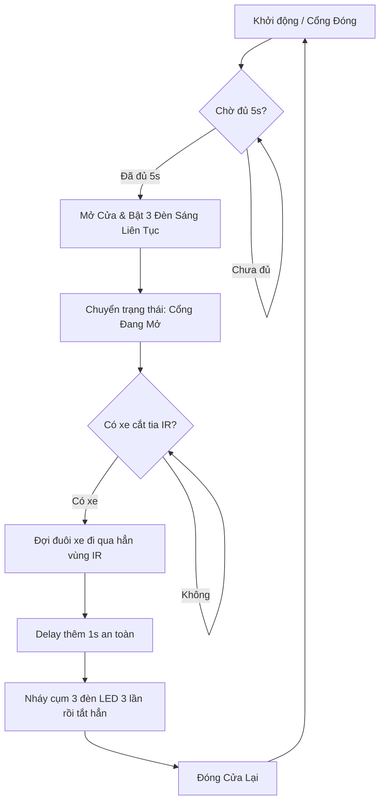

# Luồng Hoạt Động Của Hệ Thống GateInTest

Tài liệu này mô tả chi tiết logic hoạt động và máy trạng thái (state machine) của hệ thống điều khiển cổng `GateInTest` sử dụng ESP32.

## 1. Quá trình Khởi động (Hàm `setup()`)

Khi hệ thống vừa được cấp nguồn hoặc khởi động lại, các bước sau sẽ được thực hiện:

*   **Thiết bị hiển thị & cảnh báo:** 
    *   Khởi tạo và bật sáng màn hình LCD qua I2C (SDA: 21, SCL: 22). Hiển thị dòng chữ chào mừng.
    *   Khởi tạo trạng thái tắt hoàn toàn (mức `LOW`) cho cụm 3 đèn LED báo hiệu (chân 12, 13, 14).
    *   Cấu hình giao tiếp I2S cho module âm thanh MAX98357A.
*   **Thiết bị điều khiển:** 
    *   Gắn kết động cơ Servo vào chân 33.
    *   Điều khiển động cơ Servo quay về góc `180°` (trạng thái cổng đóng).
*   **Lưu trạng thái ban đầu:** 
    *   Hệ thống ghi nhận lại mốc thời gian ngay lúc khởi động (`lastCloseTime = millis()`).
    *   Đánh dấu trạng thái cửa đang đóng: `isGateOpen = false`.

---

## 2. Quá trình Vận hành (Hàm `loop()`)

Hệ thống hoạt động theo một vòng lặp vô tận, liên tục kiểm tra trạng thái của biến `isGateOpen` để xử lý 1 trong 2 trường hợp:

### A. Khi Cổng Đang Đóng (`isGateOpen == false`)

Hệ thống sẽ liên tục kiểm tra thời gian trôi qua. Hiện tại, đoạn code đang giả lập một tín hiệu yêu cầu mở cổng bằng cách đếm thời gian tự động là **5 giây**.
*(Trong thực tế, điều kiện đếm 5 giây này có thể được thay thế bằng việc kiểm tra thẻ RFID hoặc tín hiệu từ Camera AI).*

Khi thỏa mãn điều kiện yêu cầu mở cổng, hệ thống sẽ:
1.  **Mở cổng:** Điều khiển Servo quay chậm rãi từ góc đóng (180°) sang góc mở (90°).
2.  **Đèn báo:** Bật cụm 3 đèn LED sáng liên tục (`HIGH`).
3.  **Màn hình & Loa:** LCD cập nhật dòng thông báo *"Moi xe vao..."*. Đồng thời, hệ thống loa I2S phát ra 3 tiếng bíp tít cảnh báo.
4.  **Cập nhật trạng thái:** Đánh dấu cờ `isGateOpen = true` để chuyển sang chế độ theo dõi xe đi vào.

### B. Khi Cổng Đang Mở (`isGateOpen == true`)

Lúc này, cổng đã mở và 3 đèn LED đang sáng. Bộ não của hệ thống sẽ tập trung đọc tín hiệu từ cảm biến vật cản hồng ngoại (`IR_PIN`):

1.  **Phát hiện có xe đi vào:** 
    *   Ngay khi đầu xe cắt ngang tia hồng ngoại của cảm biến (tín hiệu lên mức `HIGH`), màn hình LCD sẽ chuyển sang hiển thị *"Xe dang qua..."*.
2.  **Chờ xe đi qua hẳn:** 
    *   Hệ thống sẽ đi vào một vòng lặp `while(true)`. Cổng sẽ được giữ mở vô thời hạn cho tới khi tín hiệu cảm biến hồng ngoại rơi trở lại mức `LOW` (nghĩa là đuôi xe không còn chắn ngang tia nữa).
3.  **Delay an toàn:** 
    *   Sau khi xe qua khỏi tia, hệ thống sẽ `delay(1000)` (đợi thêm 1 giây) để đảm bảo đuôi xe hoặc biển số xe đã hoàn toàn rời khỏi vùng nguy hiểm của cánh cổng.
4.  **Cảnh báo đóng cửa:** 
    *   Hệ thống thực hiện chu kỳ nháy 3 đèn LED báo hiệu **3 lần liên tục** (mỗi chu kỳ nháy mất 500ms gồm tắt và bật). 
    *   Sau khi nháy xong, toàn bộ 3 đèn sẽ được tắt hẳn (`LOW`).
5.  **Đóng cửa lại:** 
    *   Điều khiển động cơ Servo quay mượt mà từ góc mở (90°) trở lại góc đóng (180°).
6.  **Khôi phục trạng thái chờ:** 
    *   Hệ thống đặt lại cờ `isGateOpen = false`.
    *   Cập nhật lại thời điểm đóng cửa gần nhất `lastCloseTime = millis()` để tái khởi động lại chu kỳ đếm lùi 5 giây ban đầu.

---

## 3. Tóm Gọn Sơ Đồ Khối Luồng Hoạt Động

